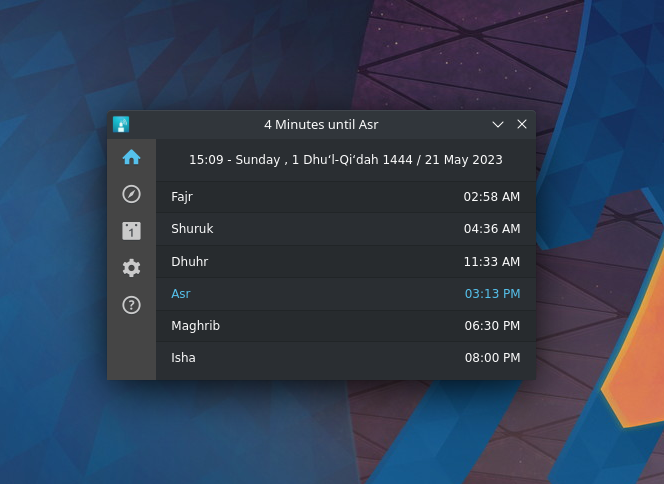

  

<H1 align="center">SilatyQt</H1>

A neat prayer reminder app made in Qt (written in c++)

  
## Previews
  

Windows

Linux

macOS

## Building
  - Get [Qt Creator](https://www.qt.io/product/development-tools)
  - Clone this repository
  - Open it in Qt Creator
  - Build it!
  
  - **Note: Distributing it would require using [windeployqt](https://doc.qt.io/qt-6/windows-deployment.html) (for Windows) or [CQtDeployer](https://github.com/QuasarApp/CQtDeployer) (for Linux) or [macdeployqt](https://doc.qt.io/qt-6/macos-deployment.html) (for macOS)**
  
## Credits

### Qt App
  - [mustafakhalaf-git ~~(GitMuslim)~~](https://github.com/mustafakhalaf-git)

### Original GTK App
  - [AXeL-dev](https://github.com/AXeL-dev)
  - [Jessewb786](https://github.com/Jessewb786)

### Prayer Times Calculator
  - [Prayer Times Calculation using C++](https://www.youtube.com/watch?v=3IrJoov8yfw)
  - [Source Code (Google Drive)](https://drive.google.com/file/d/10RRocsgs80exYBlEKX3GesD_Px1pv-OI/view)
## License

SilatyQt and Silaty are licensed under the [GPL license](LICENSE).
